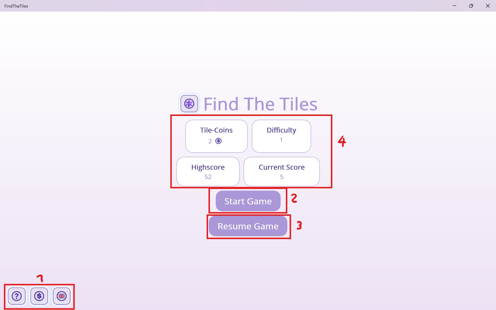

  

  
  
  
  
  
  
  
  
  
  
  

---

# 🧩 About Find The Tiles

**Find The Tiles** is a short, memory-based puzzle game. Your goal: uncover a hidden pattern inside a 7x7 grid!  
You start with 2 guaranteed pattern tiles, and must use logic, memory, and the help of upgrades and hints to reveal the rest.  
Every session is different thanks to clever pattern generation.

---

## 🌐 Multiple Languages

Use the language change button to select between 3 languages:
- English (default)
- German
- French

---

# 🏠 Main Menu

Your journey begins at the main menu (after the tutorial):

- **Menu Bar:** Access the tutorial, shop, and language settings.
- **Start Button:** Begin a new game session.
- **Continue Game:** Resume any unfinished session.
- **Stats & Progress:** See your overall and last game progress, shop coins, and difficulty level.

---

# 🎮 Game Sessions

- Start with 2 green-bordered tiles guaranteed to be part of the hidden pattern.
- Click tiles to get hints: the 4 adjacent tiles are scanned and marked if they are part of the pattern.
- Progress bar shows your uncovering progress.
- Too many wrong guesses = you lose the session!
- Use special shop items for help.
- Info field shows score, progress, multiplier, and more.
- Exit the session any time.

---

# 🧬 Pattern Generation

Find The Tiles uses a custom algorithm for interesting, challenging grid patterns:

- **Random starting point** (favoring the center)
- **Adjacency logic:** Next pattern tile is added with a base 25% chance, reduced based on nearby pattern tiles and edge proximity.
- The result: fun, unpredictable, and fair patterns!

Future plans: neural networks or AI-powered generation for more difficulty.

---

# 🛍️ Tile-Coins Shop

Instead of XP or levels, you earn **tile-coins** by scoring. Spend coins to buy:

- Extra missclick chances
- Increased difficulty
- Rogue-like modifiers for replayability
- Special one-use items

The shop will soon include new levels and design customization!

---

# 🎓 Interactive Tutorial

New players get a guided, interactive tutorial explaining mechanics.  
Skip steps by clicking text boxes if you already know how to play.

---

# 🚀 Try It Out

- [Download the latest release](https://github.com/kallioderso/FindTheTiles/releases/latest)
- [View the source code](https://github.com/kallioderso/FindTheTiles)

---

# 📝 Releases

## [v1.2](https://github.com/kallioderso/FindTheTiles/releases/tag/v1.2)
- Major bug fixes, new features, improved tutorial, and expanded shop system. Resume your game, enjoy new mechanics, and a refreshed design!

## [v1.1](https://github.com/kallioderso/FindTheTiles/releases/tag/v1.1)
- Improved gameplay, bug fixes, and extra fun tweaks based on community feedback.

## [v1.0](https://github.com/kallioderso/FindTheTiles/releases/tag/v1.0)
- Initial release! Core gameplay, upgrades, multi-language support, and basic tutorial.

---

# ⌨️ Shortcuts & Controls

- **Click** on tiles to guess and reveal.
- **Use menu bar** for tutorial, shop, or language.
- **Shop**: Spend coins for upgrades and items.
- **Continue/Resume**: Jump back into unfinished sessions.

---

# 🖼️ Banner & Screenshots

  

---

# 🤖 About This Project

This is my first complex .NET MAUI application.  
Devlogs are AI-assisted (my English isn’t perfect yet) — but I’m passionate about creating a fun, high-quality game and sharing it with everyone.

Thanks for checking out **Find The Tiles** — more updates coming soon!

---

# 🌐 Community & Support

- **YouTube:** Coming soon!
- **Discord:** WIP
- **Issues & Feedback:** [GitHub Issues](https://github.com/kallioderso/FindTheTiles/issues)

---

# 📜 License

This project is licensed under the [GPL-3.0 License](LICENSE).

---

> Enjoy playing Find The Tiles and help us improve with your feedback!
